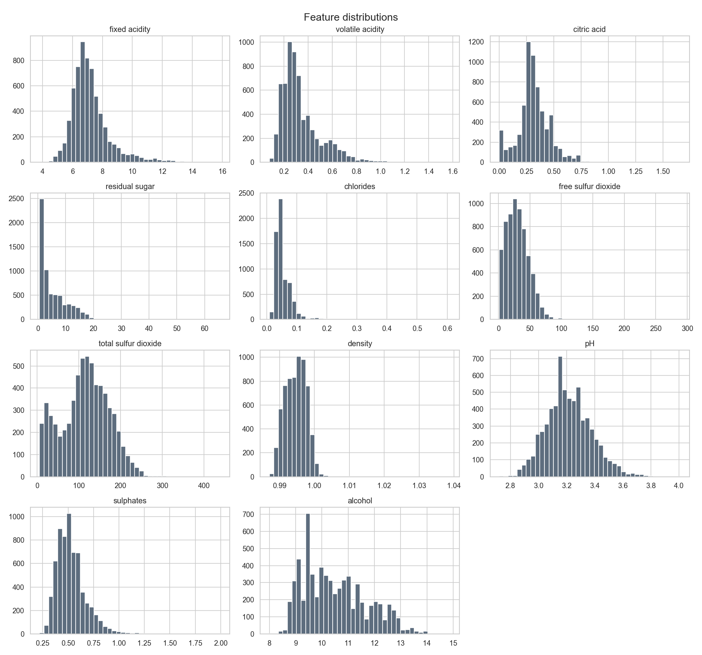
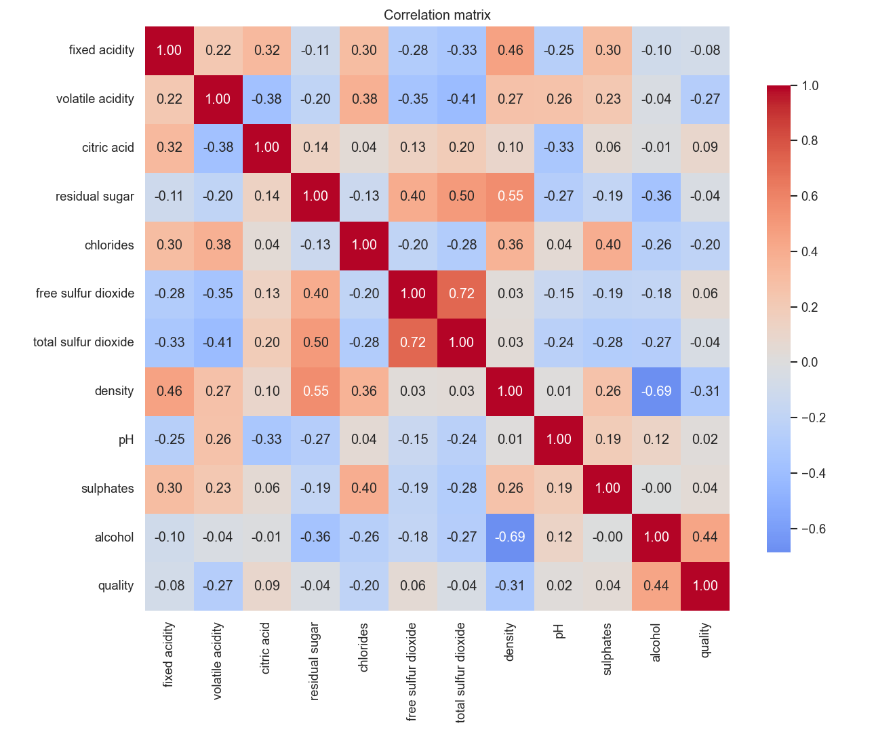
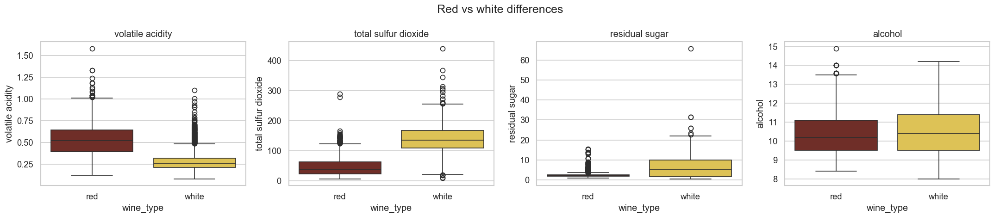
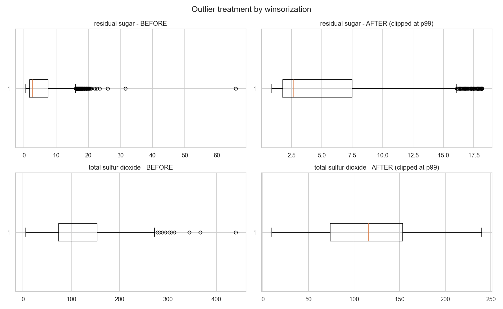
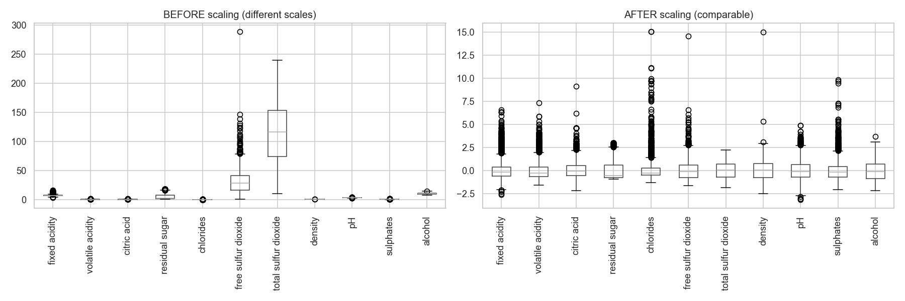

# Clasificación de Perfiles de Vino mediante un Pipeline Completo de Machine Learning

**Proyecto 2 — Inteligencia Artificial**
Escuela de Ingeniería de Sistemas y Computación — Universidad del Valle

**Autores:** [Integrante 1], [Integrante 2], [Integrante 3]
**Docente:** Andrés Mauricio Valencia Restrepo
**Fecha:** 2026

---

## Resumen

Este trabajo desarrolla una aplicación funcional que integra el ciclo completo de un
proyecto de Machine Learning sobre el conjunto de datos *Wine Quality* (UCI), que
reúne 6.497 vinos tintos y blancos descritos por 11 propiedades fisicoquímicas. El
problema se aborda en cuatro fases: (1) comprensión y preparación de los datos
mediante limpieza, tratamiento de valores atípicos por winsorización y
estandarización; (2) etiquetado no supervisado con K-Means, que descubre cuatro
perfiles de vino interpretables; (3) modelado supervisado comparando Regresión
Logística, Random Forest y una Red Neuronal para predecir el perfil; y (4) una
aplicación en Streamlit que predice el perfil de un vino nuevo. La Regresión
Logística obtuvo el mejor desempeño (F1-macro = 0,993), siendo además el modelo más
rápido y liviano. El alto desempeño se explica porque la etiqueta deriva de las
mismas variables usadas como entrada, lo que se discute como limitación. Todo el
proceso es reproducible (semilla fija) y está documentado.

**Palabras clave:** clustering, K-Means, clasificación, redes neuronales, Wine Quality.

---

## 1. Introducción

El sector vinícola evalúa la calidad de sus productos combinando análisis
fisicoquímicos de laboratorio con la cata sensorial de expertos. El conjunto de datos
*Wine Quality* (Cortez et al., 2009) recopila ambos aspectos para variantes del vino
portugués *Vinho Verde*: 11 mediciones objetivas (acidez, azúcar, alcohol, etc.) y una
puntuación de calidad asignada por catadores.

El objetivo de este proyecto es construir una **aplicación que integre todo el ciclo
de un proyecto de Machine Learning**, desde el preprocesamiento de los datos hasta la
predicción. En lugar de predecir directamente la calidad subjetiva, se planteó un
enfoque en dos etapas: primero **descubrir perfiles de vino** mediante aprendizaje no
supervisado (clustering), y luego **entrenar modelos supervisados** que aprendan a
clasificar un vino nuevo dentro de uno de esos perfiles. Este enfoque permite ejercitar
de forma natural tanto las técnicas no supervisadas como las supervisadas vistas en el
curso.

El proyecto se organiza en cuatro fases que estructuran el resto del informe:
preparación de datos, etiquetado no supervisado, modelado supervisado y desarrollo de
la aplicación.

---

## 2. Descripción del problema y del dataset

El dataset combina dos archivos: **1.599 vinos tintos** y **4.898 vinos blancos**,
ambos con las mismas 11 variables fisicoquímicas y una variable `quality` (entero de 0
a 10). Los archivos originales usan `;` como separador. Se añadió una variable
categórica `wine_type` (tinto/blanco) para combinar ambos archivos en un único conjunto
de 6.497 muestras.

**Tabla 1. Variables del dataset.**

| Variable | Descripción |
|---|---|
| fixed acidity | Acidez fija (tartárica) |
| volatile acidity | Acidez volátil (acética) |
| citric acid | Ácido cítrico |
| residual sugar | Azúcar residual |
| chlorides | Cloruros (sal) |
| free sulfur dioxide | Dióxido de azufre libre |
| total sulfur dioxide | Dióxido de azufre total |
| density | Densidad |
| pH | Acidez total (pH) |
| sulphates | Sulfatos |
| alcohol | Grado alcohólico |
| quality | Puntuación de calidad (target original) |

El análisis exploratorio (Figuras 1–3) reveló: (a) un fuerte desbalance en `quality`,
concentrado en las clases 5 y 6; (b) correlaciones notables, como `free`–`total sulfur
dioxide` (0,72) y `density`–`alcohol` (−0,69), siendo `alcohol` la variable más
correlacionada con la calidad (0,44); y (c) diferencias estructurales claras entre
tintos y blancos, especialmente en dióxido de azufre y acidez volátil.

**Figura 1.** Distribución de las 11 variables fisicoquímicas.

**Figura 2.** Matriz de correlación entre variables.

**Figura 3.** Diferencias estructurales entre vinos tintos y blancos.

---

## 3. Metodología

### 3.1 Fase 1 — Preprocesamiento

Se aplicaron, en orden, las siguientes transformaciones (módulo `preprocessing.py`):

1. **Combinación** de tintos y blancos en un único DataFrame con la variable
   `wine_type`.
2. **Validación de nulos:** se confirmó la ausencia de valores faltantes.
3. **Eliminación de duplicados:** se detectaron y eliminaron 1.177 filas duplicadas
   (~18 %), pasando de 6.497 a 5.320 muestras. Se justifica porque las filas repetidas
   sesgan el clustering y los modelos, y pueden filtrar información entre las
   particiones de entrenamiento y prueba.
4. **Tratamiento de outliers por winsorización:** en lugar de eliminar filas extremas,
   los valores por encima del percentil 99 se recortaron a ese percentil en `residual
   sugar` y `total sulfur dioxide` (Figura 4). Esto preserva el tamaño de muestra.
5. **Codificación** de `wine_type` como binaria (tinto = 0, blanco = 1).
6. **Estandarización** con `StandardScaler` (media 0, desviación 1), ajustada
   únicamente con el conjunto de entrenamiento para evitar fuga de datos (Figura 5).
7. **Partición estratificada** en 70 % entrenamiento, 15 % validación y 15 % prueba.

**Figura 4.** Tratamiento de valores atípicos por winsorización (antes/después).

**Figura 5.** Efecto del escalado: antes, el dióxido de azufre domina; después, todas
las variables son comparables.

### 3.2 Fase 2 — Etiquetado no supervisado (clustering)

Se aplicó **K-Means** sobre las 11 variables escaladas (módulo `clustering.py`). El
número de grupos *k* se eligió analizando tres criterios (Figura 6): el método del
codo (inercia), el coeficiente de **silueta** (mayor es mejor) y el índice de
**Davies-Bouldin** (menor es mejor). Se seleccionó **k = 4**, pues minimiza el índice
de Davies-Bouldin (1,486), obtiene una silueta cercana al máximo y produce cuatro
perfiles interpretables (k = 2 solo separaría tinto/blanco). Adicionalmente, K-Means se
comparó con *clustering* jerárquico aglomerativo y DBSCAN.

Los cuatro clusters se interpretaron a partir de las medias de sus centroides
(Figuras 7–8) y se nombraron en consecuencia:

**Tabla 2. Perfiles descubiertos.**

| Cluster | Características dominantes | Nombre asignado | n |
|---|---|---|---|
| 0 | Azúcar alta, SO₂ alto, alcohol bajo | Blancos dulces bajos en alcohol | 1.409 |
| 1 | Acidez volátil alta, pH alto | Tintos ligeros ácidos | 852 |
| 2 | Acidez fija y sulfatos altos | Tintos estructurados intensos | 590 |
| 3 | Alcohol alto, densidad baja | Vinos secos de alto alcohol | 2.469 |

La columna `cluster_label` resultante constituye la variable objetivo de la Fase 3.

**Figura 6.** Criterios para elegir el número de clusters.

**Figura 7.** Proyección PCA a 2D de los cuatro clusters.

**Figura 8.** Perfiles de cada cluster (medias estandarizadas de las variables).

### 3.3 Fase 3 — Modelado supervisado

La tarea es clasificar el `cluster_label` a partir de las 11 variables más
`wine_type` (12 entradas). Se entrenaron tres modelos (módulos `models.py` y
`evaluation.py`):

- **Regresión Logística** (baseline lineal), con `class_weight='balanced'`.
- **Random Forest** (300 árboles), modelo clásico robusto.
- **Red Neuronal** (Keras): dos capas ocultas (64 y 32 neuronas, ReLU), con
  `BatchNormalization`, `Dropout(0,3)`, `EarlyStopping` y `ReduceLROnPlateau`.

Dado el desbalance de las clases (proporción ~4:1), las métricas se calcularon con
promedio **macro**, que pondera igual a todas las clases.

### 3.4 Fase 4 — Aplicación

Se desarrolló una aplicación en **Streamlit** (`app.py`) que permite ingresar las
propiedades de un vino mediante deslizadores, ejecuta el modelo final y muestra el
perfil predicho junto con la probabilidad de cada clase. La aplicación reutiliza el
mismo `StandardScaler` y el mismo modelo entrenados en las fases anteriores,
garantizando coherencia entre el entrenamiento y la predicción.

---

## 4. Implementación

El proyecto se desarrolló íntegramente en **Python 3.12**, organizado en módulos
reutilizables dentro de `src/` y notebooks de análisis en `notebooks/`:

- `preprocessing.py` — Fase 1.
- `clustering.py` — Fase 2.
- `models.py` y `evaluation.py` — Fase 3.
- `app.py` — Fase 4.
- Notebooks `01`–`04` — análisis exploratorio, preprocesamiento, clustering y modelos.

Se usaron pandas y NumPy (manejo de datos), scikit-learn (preprocesamiento, clustering
y modelos clásicos), TensorFlow/Keras (red neuronal), matplotlib y seaborn
(visualización) y Streamlit (aplicación). Para garantizar la **reproducibilidad**, se
fijó la semilla `random_state = 42` en todo el código y se definieron las versiones de
las dependencias en `requirements.txt`.

---

## 5. Resultados

### 5.1 Comparación de modelos

Todos los modelos se evaluaron sobre el conjunto de prueba (Tabla 3).

**Tabla 3. Comparación de modelos sobre el conjunto de prueba.**

| Modelo | Accuracy | F1-macro | ROC-AUC | T. entren. (s) | T. inferencia (s) |
|---|---|---|---|---|---|
| **Regresión Logística** | **0,995** | **0,993** | 0,99998 | 0,04 | 0,0003 |
| Red Neuronal | 0,984 | 0,980 | 0,9997 | 25,56 | 0,177 |
| Random Forest | 0,965 | 0,959 | 0,9987 | 1,00 | 0,097 |

La red neuronal detuvo su entrenamiento en la época 23 gracias a `EarlyStopping`
(Figura 9), evidenciando control del sobreajuste. La matriz de confusión del modelo
final (Figura 10) muestra muy pocos errores de clasificación.

**Figura 9.** Curvas de pérdida y exactitud de la red neuronal (entrenamiento vs
validación).

**Figura 10.** Matriz de confusión del modelo final.

### 5.2 Selección del modelo final

Se eligió la **Regresión Logística** como modelo final por combinar el mejor
F1-macro (0,993) con el menor costo computacional (entrenamiento e inferencia más
rápidos y menor tamaño en disco). Que un modelo lineal alcance el mejor desempeño
indica que las clases son casi linealmente separables.

### 5.3 Aplicación

La aplicación carga el modelo y el scaler entrenados, recibe las 11 propiedades del
vino y `wine_type`, y devuelve el perfil predicho junto con un gráfico de
probabilidades. Una prueba con un vino de alto grado alcohólico y baja densidad fue
clasificada correctamente como «vinos secos de alto alcohol» con probabilidad 1,0.

---

## 6. Discusión y limitaciones

El desempeño extraordinariamente alto de todos los modelos (~99 %) **no debe
interpretarse ingenuamente como éxito**. La variable objetivo (`cluster_label`) fue
generada por K-Means a partir de las mismas 11 variables que luego se usan como
entrada; por lo tanto, las features definen los clusters de forma casi determinista y
la tarea de clasificación resulta intrínsecamente sencilla. Esto valida que el pipeline
funciona correctamente, pero no constituye un problema predictivo difícil.

Como **trabajo futuro**, un reto genuino sería predecir la variable `quality` original
(la puntuación de los catadores), que sí es difícil por su subjetividad y desbalance, y
para la cual técnicas como SMOTE o el ajuste de umbrales serían pertinentes.

---

## 7. Conclusiones

Una reflexión por cada algoritmo utilizado, según lo solicitado:

- **K-Means:** permitió descubrir estructura latente en los datos y generar etiquetas
  interpretables sin supervisión. La elección de *k* mediante múltiples criterios
  (codo, silueta, Davies-Bouldin) fue clave para obtener perfiles con sentido. Su
  principal limitación es que asume grupos esféricos y depende del escalado previo.

- **Regresión Logística:** resultó el modelo más eficiente y, en este problema, el más
  preciso. Confirma que cuando las clases son linealmente separables, un modelo simple
  e interpretable supera a alternativas más complejas, además de ser el más rápido.

- **Random Forest:** ofreció un desempeño sólido y robusto sin apenas ajuste, captando
  relaciones no lineales. Aunque fue el de menor F1-macro en este caso, sigue siendo
  una opción muy confiable para datos tabulares.

- **Red Neuronal:** alcanzó un desempeño competitivo y permitió aplicar técnicas de
  regularización (Dropout, BatchNorm) y control del sobreajuste (EarlyStopping). Sin
  embargo, su mayor costo computacional no se justificó frente a la Regresión Logística
  para este problema, ilustrando que el modelo más complejo no siempre es el mejor.

En conjunto, el proyecto cumplió el objetivo de integrar el ciclo completo de un
proyecto de Machine Learning de forma reproducible, desde datos crudos hasta una
aplicación funcional de predicción.

---

## 8. Referencias

- Cortez, P., Cerdeira, A., Almeida, F., Matos, T., & Reis, J. (2009). *Modeling wine
  preferences by data mining from physicochemical properties.* Decision Support
  Systems, 47(4), 547–553.
- Pedregosa, F. et al. (2011). *Scikit-learn: Machine Learning in Python.* Journal of
  Machine Learning Research, 12, 2825–2830.
- Abadi, M. et al. (2015). *TensorFlow: Large-Scale Machine Learning on Heterogeneous
  Systems.*
- Dua, D., & Graff, C. (2019). *UCI Machine Learning Repository.* University of
  California, Irvine. https://archive.ics.uci.edu/dataset/186/wine+quality
